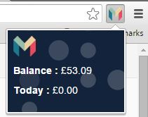

# Mon.do Chrome Extension
A browser extension for your Mondo account to get display your current balance and days spending
 

  

<b>To use:</b> 
Replace the contents of the config/prod.js with your own details 
Open Chrome->Settings->More Tools->Extentions 
Tick 'Developer Mode' 
Click 'Load unpacked extension...' 
Select the folder 'Mon.do.extension.chrome' folder 
Click 'Options' 
Input your username and passworld then click 'Save' 
Click on the Mondo icon in your Chrome window 

 
Apologies for the code, it's definitely a hack and this is cleaned up!
